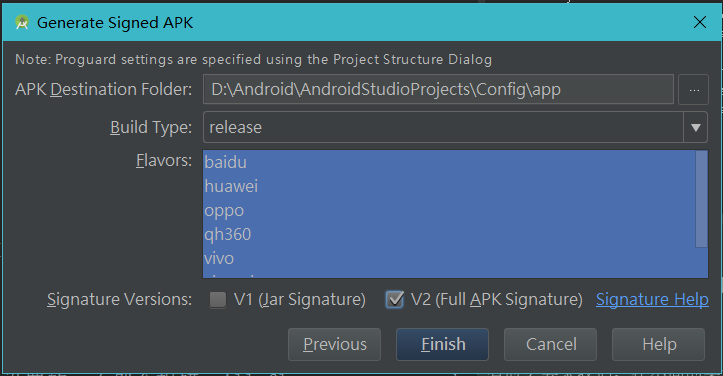
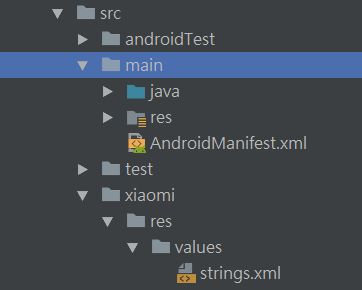
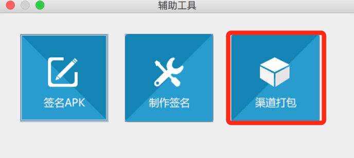
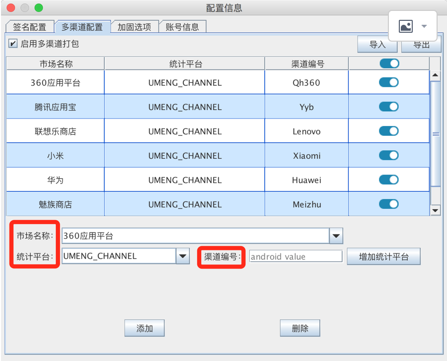
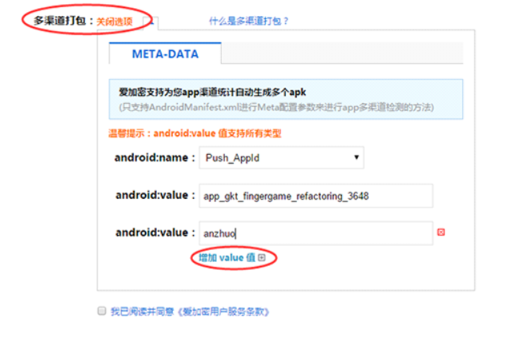
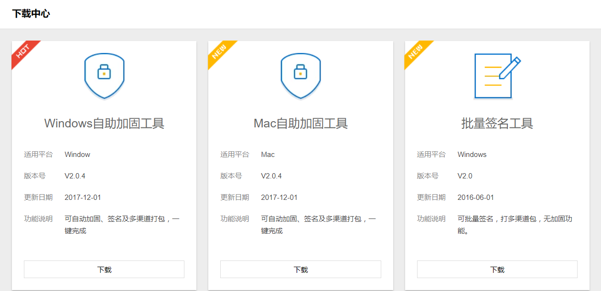

## 多渠道打包

### 1、 Flavor方式

实现多渠道打包，根据App名称、渠道名称、版本号、打包方式、日期 重命名输出的apk名字。

#### Tip

1 渠道多了比较慢

2 不同渠道可以拥有不同的类、资源、jar包

#### 多渠道打包及输出sdk文件重命名

**需求**

为了统计不同渠道的推广效果，在上线之前，常常会给不同渠道打不同的apk包，渠道多了人工打包效率低下，所以才需要多渠道的自动打包，最好能让运营人员根据apk的名字，知道渠道、版本等一些列信息。

**实现**

**AndroidManifest.xml** 

动态渠道名称 

    <application>
         ...
         <meta-data android:name="CHANNEL" android:value="${CHANNEL_VALUE}" />
         ...
    </application>
    

**app\build.gradle**

productFlavors{     } ：定义渠道名称

productFlavors.all {    }  ： 将定义的渠道名称动态赋值

android.applicationVariants.all {   }   ： 动态设置apk包的名称

flavorDimensions(   )   ：  gradle3.0 需要设置的，不然会报错。All flavors must now belong to a named flavor dimension. 
       
        android{
            ...
            defaultConfig {
                ...
                flavorDimensions("channel")
                ...
            }
            productFlavors{
                qh360{}
                xiaomi{ }
                baidu{ }
                huawei{ }
                oppo{ }
                vivo{ }
                yingyongbao{ }
            }
        
            productFlavors.all {
                flavor -> flavor.manifestPlaceholders = [CHANNEL_VALUE : name]
            }
   
            android.applicationVariants.all {
                variant -> variant.outputs.all {
                    def appName = "config"
                    def date = new Date()
                    def formattedDate = date.format('yyMMdd_HHmm')
                    outputFileName = appName+"_${variant.name}_${variant.versionName}_"+formattedDate+".apk"
                }
            }
            ...
         }

**打包操作**

在build - Generate Signed apk 时复选所有渠道，并勾选V2.
       

         
#### 不同版本定制化资源和代码
         
**需求**
         
有时会要求我们，在不同的渠道上显示不同的java代码、资源，甚至引用不同的jar包。例如，不同渠道的启动也常常是不一样的。同样需要我们能在自动打包时实现上述需求。
         
**实现一**   

将不同的代码、资源，写到与渠道名称一样的文件夹下。

第一步：在app\src下新建文件夹，文件夹名称必须和渠道名称一样，例如：xiaom，qh360等。
      
第二步：在第一步新建的文件夹下，再新建文件夹及文件例如：res\values\string.xml、res\layout等等。保持和src下的main文件下的文件一样，资源和代码都以此类推。    
     
第三部：打包即可看到效果。    
     
 
     
     
**实现二**
     
在java代码中获取AndroidManifest.xml中配置的渠道信息，不同渠道执行不同的代码。

        try {
                ApplicationInfo applicationInfo = this.getPackageManager().getApplicationInfo(getPackageName(), PackageManager.GET_META_DATA);
                String channelValue = applicationInfo.metaData.getString("CHANNEL");
    
                switch (channelValue){
                    case "xiaomi":{
                        mTextMessage.setText("xiaomi is the first");
                        break;
                    }
                    case "qh360":{
                        mTextMessage.setText("qh360 is the second");
                        break;
                    }
                    case "baidu":{
                        mTextMessage.setText("baidu is the thread");
                        break;
                    }
                    default:
                }
    
            } catch (PackageManager.NameNotFoundException e) {
                e.printStackTrace();
            }

     
#### 遇到问题

问题1

No signature of method: java.lang.Integer.call() is applicable for argument types: 
 
解决办法

productFlavors{ }中渠道名称不要以数字开头，把360改为了qh360

问题2

Error:All flavors must now belong to a named flavor dimension.

解决办法

gradel 3.0需要设置的

        defaultConfig {
            ...
            flavorDimensions("channel")
            ...
        }
        
问题3
        
Cannot set the value of read-only property 'outputFile' 

解决办法

    applicationVariants.all { variant -> 
        variant.outputs.each { output ->
            def SEP = "_"
            def flavor = variant.productFlavors[0].name
            def buildType = 
            variant.variantData.variantConfiguration.buildType.name
            def version = variant.versionName
            def date = new Date()
            def formattedDate = date.format('ddMMyy_HHmm')
            def newApkName = PROJECT_NAME + SEP + flavor + SEP + buildType + SEP + version + SEP + formattedDate + ".apk"
            def file = new File(newApkName)
            output.outputFile = file
        }
    }
    
    
gradle 3.0版本中需要修改：

  1.Use all() instead of each()

  2.Use outputFileName instead of output.outputFile if you change only file name (that is your case)

        android.applicationVariants.all {
            variant -> variant.outputs.all {
                def appName = "config"
                def date = new Date()
                def formattedDate = date.format('yyMMdd_HHmm')
                outputFileName = appName+"_${variant.name}_${variant.versionName}_"+formattedDate+".apk"
            }
        }
 
 
### 2、 360加固、爱加密、腾讯云·乐固等第三方加密工具方式

通过第三方加固平台进行加固，并输出多渠道包。

#### Tip ####

不建议将360加固之后的apk传到其它渠道

#### 介绍

**需求**

由于apk需要加固，综合考虑决定采用第三方加密的模式。而且360渠道上传app，强制使用360加固。

如果采用第一种gradle的方式进行多渠道打包，再分别去加密平台进行加密，工作量太大，而采用加密平台提供的多渠道打包方式则相对简单。

**实现**

 1.提供一个apk包到加密平台进行加密
 
 2.通过提供的多渠道打包工具，输出多个加密之后的apk包。
 
 3.通过提供的签名工具，批量进行签名。
 
具体实现可阅读各个平台的文档，非常详细，也很容易上手。

360加固平台：
 
 
 
 
 

 爱加密平台：
 
 
 
 腾讯云乐固
 
 

###  Walle快速打包方式  ###

[点击进入Walle](https://github.com/ZhangShuFly/TinkerDemo)